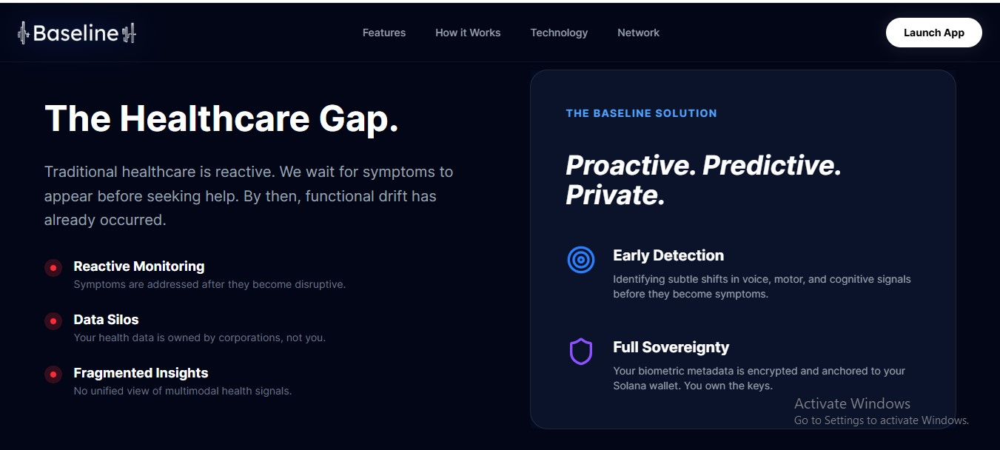
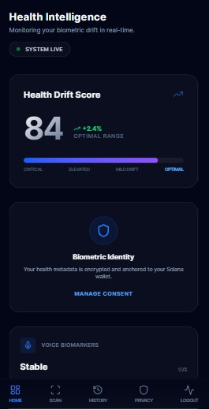

# Baseline: AI-Powered Predictive Health Intelligence

**Baseline** is an advanced health intelligence platform that detects early "functional drift" by analyzing multimodal biometric signals. By cross-referencing voice analysis, motor reaction timings, cognitive performance, and facial mesh data, Baseline provides a comprehensive Health Drift Score anchored immutably on the Solana blockchain.

## 🚀 Key Features and Challenges

Baseline was built to solve the challenge of fragmented and unverifiable health data. Traditional health apps store data in centralized silos, making it difficult to prove the integrity of historical records. 

*   **Multimodal Analysis**: We integrated disparate biometric signals into a unified scoring engine.
*   **On-Chain Verification**: We solved the integrity problem by anchoring anonymized IPFS metadata hashes to Solana, ensuring a verifiable and immutable health timeline.
*   **AI Feedback**: Implementing real-time voice synthesis via ElevenLabs to provide accessible, human-like health coaching based on scan results.

---

## 🛠 Technology Stack

### Core Frameworks
*   **Frontend**: React 19 with TypeScript, Next.js 15 (App Router), Tailwind CSS v4, Framer Motion.
*   **Backend**: Node.js & Express.js (REST API).
*   **AI Service**: FastAPI (Python) for biometric signal processing and drift detection.

### Blockchain & Storage
*   **Blockchain**: Solana (Rust/Anchor Program).
*   **Infrastructure**: `@solana/web3.js`, `@coral-xyz/anchor`.
*   **Storage**: IPFS (via Pinata) for decentralized metadata persistence.

### Integrations
*   **Voice AI**: ElevenLabs API for high-fidelity text-to-speech feedback.
*   **Wallet**: Solana Wallet Adapter for secure user authentication and consent verification.

---

## 🏗 Architecture Decisions

*   **Solana (Anchor/Rust)**: We chose Solana for its high throughput and low transaction costs, which are essential for logging frequent health scan events without friction for the user.
*   **IPFS for Metadata**: Storing raw biometric data on-chain is prohibitively expensive. We use IPFS to store detailed scan metadata and anchor only the CID (Content Identifier) on-chain.
*   **ElevenLabs over standard TTS**: Health data is sensitive and personal. ElevenLabs provides a "human" element to the feedback, increasing user trust and engagement compared to robotic browser-default synthesis.
*   **Wallet Signature**: We use a simple authentication strategy where the user signs a message with their wallet to establish session identity, proving ownership of the health history.

---

## 🗺 Architecture Overview

1.  **Capture**: Frontend captures voice, motor, and facial data via browser APIs.
2.  **Analyze**: Data is sent to the FastAPI AI service for scoring and risk assessment.
3.  **Secure**: Metadata is uploaded to IPFS (Pinata).
4.  **Anchor**: The resulting IPFS CID is sent to the Solana program (`baseline_program`) via the backend, creating an immutable proof of the scan.
5.  **Feedback**: ElevenLabs generates a voice summary of the health report for the user.

---

## ⚙️ Setup Instructions

### Prerequisites
*   Node.js 18+
*   Solana CLI & Anchor (for blockchain development)
*   Python 3.9+ (for AI service)

### 1. Backend Setup
```bash
cd backend
npm install
cp .env.example .env
# Fill in your PINATA_JWT, ELEVENLABS_API_KEY, and SOLANA_PROGRAM_ID
npm run dev
```

### 2. Frontend Setup
```bash
cd frontend
npm install
cp .env.example .env
# Set NEXT_PUBLIC_API_URL to your backend
npm run dev
```

### 3. AI Service Setup
```bash
cd ai-service
pip install -r requirements.txt
python main.py
```

### 4. Blockchain Deployment
```bash
cd blockchain
anchor build
anchor deploy
```

---

## 📄 Environment Variables

### Backend (`backend/.env`)
| Variable | Description | Example Value |
| :--- | :--- | :--- |
| `PORT` | Server Port | `5000` |
| `SOLANA_PROGRAM_ID` | Deployed Program Address | `4tSkA5NcQAerpErKUukc3N9m5Mzyih9xLtyoskrsEsVu` |
| `SOLANA_RPC_URL` | Solana Cluster URL | `https://api.devnet.solana.com` |
| `PINATA_JWT` | Pinata API Access Token | `your_pinata_jwt_here` |
| `ELEVENLABS_API_KEY` | ElevenLabs Access Key | `your_elevenlabs_key_here` |
| `AI_SERVICE_URL` | AI Microservice Endpoint | `http://localhost:8000` |

### Frontend (`frontend/.env`)
| Variable | Description | Example Value |
| :--- | :--- | :--- |
| `NEXT_PUBLIC_API_URL` | Backend API Address | `http://localhost:5000` |
| `NEXT_PUBLIC_SOLANA_NETWORK` | Cluster Name | `devnet` |

---

## 🔗 Deployment Addresses

*   **Solana Program ID (Devnet)**: `4tSkA5NcQAerpErKUukc3N9m5Mzyih9xLtyoskrsEsVu`
    *   **Frontend**: [baseline-frontend-alpha.vercel.app](https://baseline-frontend-alpha.vercel.app/)
    *   **Backend**: [backend-production-f39f.up.railway.app](https://backend-production-f39f.up.railway.app/)
    *   **Solana Explorer**: https://explorer.solana.com/address/4tSkA5NcQAerpErKUukc3N9m5Mzyih9xLtyoskrsEsVu?cluster=devnet

---

## 📸 Screenshots

### Desktop Dashboard


### Mobile Scan Interface


---

## ⚖️ License
Distributed under the MIT License. See `LICENSE` for more information.
